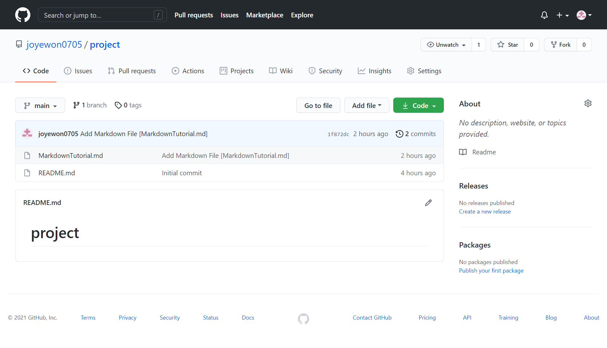

[GitHub repository URL](https://github.com/joyewon0705/project.git)

# git & GitHub 학습하기

## <시작하기>

본격적인 프로젝트에 앞서 먼저 git 소프트웨어를 설치하고 환경설정을 진행해보자.

1. git 소프트웨어 [설치](https://git-scm.com/downloads)하기
2. 
환경설정

    - `config` 명령어로 git 환경설정하기

            $ git config <옵션>

        - `--global` 옵션은 컴퓨터 전체에 대한 설정을 의미함
        - `--list` 옵션을 사용해 설정을 확인할 수 있음

    - 더 많은 설정은 [여기](https://git-scm.com/book/ko/v2/Git%EB%A7%9E%EC%B6%A4-Git-%EC%84%A4%EC%A0%95%ED%95%98%EA%B8%B0#_git_config "Git 설정하기")를 참조  

config 명령어로 사용자 정보를 설정해보자.

        
사용자 이름은 joyewon0705, 이메일 주소는 joyewon0705@naver.com로 설정된 것을 확인할 수 있다.

---

## <git 저장소 만들기>

이제 컴퓨터에 프로젝트를 저장할 git 저장소를 만들어보자. 그 첫 번째 방법은 기존 디렉토리를 git 저장소로 만드는 것이다.

### 
기존 디렉토리를 git 저장소로 만들기

    
1. git 저장소로 만들 로컬 디렉토리로 이동
    
        $ cd <디렉토리 경로>

2. `init` 명령어로 git 저장소 만들기

       $ git init

    - git 저장소로 초기화하는 역할
    - `.git` 이라는 하위 디렉토리가 생성됨  
    
기존에 존재하는 project 디렉토리를 git 저장소로 만들어보자.

project 디렉토리 안에 git 디렉토리가 생성된 것을 확인할 수 있다.  

git 저장소를 만드는 또 다른 방법은 다른 git 저장소를 clone하는 것이다.
        
### 
git 저장소를 clone하기

- `clone` 명령어로 git 저장소 불러오기

        $ git clone <url> <디렉토리 이름>

    - git 저장소의 모든 파일을 로컬 디렉토리로 다운로드함
    - 저장소를 clone하면 'origin'이라는 리모트 저장소가 자동으로 등록됨
    - GitHub에서 저장소를 불러올 경우 GitHub의 저장소를 원격 혹은 리모트 저장소, 컴퓨터 저장소를 로컬 저장소라고 함
    - 디렉토리 이름 생략 시 기존 저장소 이름과 동일한 이름의 디렉토리 생성

아래 화면의 GitHub 저장소를 clone해보자.

GitHub 저장소를 clone한 project 디렉토리가 생성된 것을 확인할 수 있다.

---

## <수정하고 저장소에 저장하기 & 되돌리기>

git 저장소를 clone해서 저장소를 만들었다. 이제 git 명령어로 저장소를 관리해보자.  
git 프로젝트에서 각 파일들은 여러 상태에 위치할 수 있는데, 파일 상태를 확인하고 싶을 때는 다음 명령어를 사용한다.

### 
파일 상태 확인하기

- `status` 명령어로 파일 상태를 확인할 수 있음

        $ git status

    - `-s` 혹은 `--short` 옵션을 사용해서 상태를 짧게 확인할 수 있음

git 저장소를 clone한 직후 status를 실행하면 다음과 같이 출력된다.

프로젝트 파일을 git 저장소에 올리려면 어떻게 해야할까?  
먼저 파일을 Staging Area에 올려서 Tracked 상태로 만들어야 한다.

### 
파일 새로 추적하기

- `add` 명령어로 파일을 새로 추적할 수 있음

        $ git add <파일>

    - 해당 파일은 Working Directory에서 Staging Area로 이동
        - Working Directory : 작업할 파일이 있는 디렉토리
        - Staging Area : 커밋을 수행할 파일들이 올라가는 영역
    
    - `add .`은 디렉토리 내의 모든 파일에 대해 적용됨

`MarkdownTutorial.md` 파일을 Staging Area에 올려보자.

`MarkdownTutorial.md` 파일이 Untracked 상태에서 add 명령어로 Tracked 상태로 변한 것을 확인할 수 있다.  
이제 이 파일은 커밋하여 로컬 저장소에 저장할 수 있다.

### 
변경사항 커밋하기

- `commit` 명령어로 파일의 스냅샷을 커밋할 수 있음

        $ git commit

    - Staging Area의 파일들이 Local Repository로 이동
    - `-m "메시지"` 옵션을 사용해 메시지를 첨부할 수 있음
    - `--amend` 옵션을 사용해 커밋 메시지를 수정할 수 있음
    - `-a` 옵션은 `add` 명령 없이 파일을 Staging Area에 자동으로 넣어줌

`MarkdownTutorial.md` 파일을 커밋 메시지와 함께 커밋해보자.

방금 수행한 커밋의 메시지를 수정해보자.

커밋 메시지를 "Add `MarkdownTutorial.md`"에서 "Add Markdown File [`MarkdownTutorial.md`]"로 수정했다.  
커밋이 올바르게 됐는지 확인하고 싶다면 커밋 히스토리를 조회할 수 있다.

### 
커밋 히스토리 조회하기

- `log` 명령어로 반영된 커밋 내역을 확인할 수 있음

        $ git log

    - `q` 입력으로 종료할 수 있음
    - `-p` 혹은 `--patch` 옵션을 사용해 각 커밋에 적용된 구체적 항목을 확인할 수 있음
    - `--stat` 옵션을 사용해 각 커밋의 통계 정보를 조회할 수 있음
    - `--pretty` 옵션은 커밋 정보를 지정한 형식으로 출력해 줌
    - 옵션에 대한 자세한 설명은 [여기](https://git-scm.com/book/ko/v2/Git%EC%9D%98-%EA%B8%B0%EC%B4%88-%EC%BB%A4%EB%B0%8B-%ED%9E%88%EC%8A%A4%ED%86%A0%EB%A6%AC-%EC%A1%B0%ED%9A%8C%ED%95%98%EA%B8%B0 "커밋 히스토리 조회하기")를 참조

커밋 히스토리를 조회해서 수정된 커밋 메시지를 확인해보자.

만약 작업을 진행하다가 실수로 커밋하지 않을 파일을 Staging Area에 올렸면 어떻게 해야 할까?

### 
파일 상태를 Unstage로 변경하기

- `reset` 명령어로 파일 상태를 변경할 수 있음
    
        $ git reset <파일>

    - Staging Area에 올라간 파일을 다시 Working Directory로 내림 = `add` 명령 취소
    - `--hard` 옵션은 특정 커밋 이후의 모든 커밋을 다 삭제하고 특정 커밋 상태로 되돌아가게 함
    - `--soft` 옵션은 특정 커밋 이후의 커밋 내역을 보관하면서 특정 커밋 상태로 되돌아가게 함

`NoCommit.txt` 파일을 Staging Area에서 내리고 싶다면 다음과 같이 수행할 수 있다 .

`NoCommit.txt` 파일이 Untracked 상태로 되돌아간 것을 확인할 수 있다.  
계속해서 작업을 진행하던 중, 현재 커밋한 `MarkdownTutorial.md` 파일이 다음과 같다고 하자.

만약 특정 커밋 버전으로 파일을 되돌리고 싶다면 reset의 hard 옵션으로 다음과 같이 수행할 수 있다.

해시값이 1f872dc인 커밋 이후의 모든 커밋이 삭제된 것을 확인할 수 있다.  
`MarkdownTutorial.md` 파일 또한 다음과 같이 해당 커밋 버전으로 되돌아간 것을 확인할 수 있다.

비슷한 기능을 하는 또 다른 명령어 checkout에 대해서도 알아보자.

### 
Modified 파일 되돌리기

- `checkout` 명령어로 파일을 최근 커밋된 버전으로 되돌릴 수 있음

        $ git checkout -- <파일>

- `reset`과 `checkout`에 대해 더 알고 싶다면 [여기](https://git-scm.com/book/ko/v2/Git-%EB%8F%84%EA%B5%AC-Reset-%EB%AA%85%ED%99%95%ED%9E%88-%EC%95%8C%EA%B3%A0-%EA%B0%80%EA%B8%B0#_git_reset)를 참조

방금 전 `MarkdownTutorial.md` 파일을 다음과 같이 수정했다고 하자.

checkout 명령어를 사용해서 이 파일을 수정 전 상태로 되돌릴 수 있다.

checkout 실행 후 파일의 변경이 무시되었음을 확인할 수 있다.  
`MarkdownTutorial.md` 파일은 다음과 같이 수정 전으로 되돌아간 것을 확인할 수 있다.

---

## <리모트 저장소>

리모트 저장소를 통해서 프로젝트를 다른 사람과 공유할 수 있다. 
먼저 등록된 리모트 저장소 목록을 관리하는 법을 알아보자.

### 
리모트 저장소 확인하기

- `remote` 명령어로 현재 프로젝트에 등록된 리모트 저장소를 확인할 수 있음

        $ git remote

    - `-v` 옵션으로 단축이름과 URL 전체 목록을 확인할 수 있음
    - `show <저장소 이름>` 옵션으로 저장소에 대한 자세한 정보를 확인할 수 있음
    - `add <저장소 이름> <URL>` 옵션으로 저장소를 등록할 수 있음
    - `rm <저장소 이름>` 옵션으로 저장소를 삭제할 수 있음
    - `rename <저장소 이름> <바꿀 이름>` 옵션으로 저장소 이름을 바꿀 수 있음

현재 등록된 리모트 저장소를 확인해보자.

로컬 저장소에 있는 파일을 리모트 저장소에 저장하고 싶다면 다음 명령어를 사용하면 된다.

### 
리모트 저장소에 push하기

- `push` 명령어로 로컬 저장소에서 리모트 저장소로 파일을 올릴 수 있음

        $ git push <리모트 저장소> <브랜치>

    - `-f` 옵션으로 강제로 push할 수 있음

push 명령을 사용해 프로젝트를 GitHub의 리모트 저장소에 전송해보자.

다음과 같이 리모트 저장소에 저장된 파일을 확인할 수 있다.

`MarkdownTutorial.md` 파일을 수정하고 리모트 저장소에 저장해보자.

반대로 리모트 저장소의 파일을 로컬 저장소에 저장하고 싶다면 다음 명령어를 사용하면 된다.

### 
리모트 저장소를 pull하기

- `pull` 명령어로 리모트 저장소에서 데이터를 가져올 수 있음

        $ git pull <리모트 저장소>

pull 명령을 실행했을 때 리모트 저장소와 로컬 저장소의 상태가 같다면 다음과 같이 출력된다.

---

## <git 브랜치>

똑같은 파일을 여러 버전으로 작업하고 싶다면 어떻게 할까? 바로 브랜치를 사용하면 된다.  
브랜치는 파일을 여러 버전으로 나눠서 동시에 그리고 독립적으로 작업할 수 있도록 해준다.

### 브랜치 확인하기

- `branch` 명령어로 존재하는 브랜치를 확인할 수 있음

        $ git branch  

    - `*` 기호가 붙어 있는 브랜치는 현재 작업하는 브랜치를 나타냄

- `log` 명령어로 각 브랜치가 위치하는 커밋을 확인할 수 있음
    - `--graph` 옵션은 브랜치를 그래프 형태로 출력해 줌 
    - `log` 설명을 다시 보고 싶다면 [여기](#log)로 이동

branch와 log 명령으로 브랜치를 확인해보자.

현재 작업하는 브랜치는 main이고 가장 최근 커밋에 위치한다는 것을 확인할 수 있다.  
이제 본격적으로 브랜치를 생성하고 사용해보자.

### 
브랜치 생성하기

- `branch` 명령어로 브랜치를 생성할 수 있음

        $ git branch <브랜치 이름>
    
    - git은 기본적으로 master 브랜치를 만듦
    - 각 브랜치의 작업 내용은 독립적으로 존재함
    - `-d` 옵션으로 브랜치를 제거할 수 있음

develop 브랜치를 만들어보자.

다른 브랜치로 이동하는 방법은 다음과 같다.

### 
브랜치 이동하기

- `checkout` 명령어로 특정 브랜치로 접속할 수 있음

        $ git checkout <브랜치 이름>

    - HEAD를 특정 브랜치로 움직임
        - HEAD는 현재 작업하는 로컬 브랜치를 가르킴
    - `-b` 옵션으로 브랜치 생성과 checkout을 동시에 할 수 있음

develop 브랜치로 이동해보자.

main 브랜치와 develop 브랜치에서 각각 작업한 내용을 하나로 합치고 싶다면 다음 두 가지 명령어를 사용할 수 있다.

### 
브랜치 합치기 - merge

- `merge` 명령어로 현재 접속한 브랜치와 다른 브랜치를 합칠 수 있음

        $ git merge <브랜치 이름>

    - 두 브랜치에서 같은 파일의 한 부분을 동시에 수정했다면 충돌이 일어나는데, 이 경우에는 충돌이 일어난 파일을 직접 수정하여 merge할 수 있음
    - merge는 브랜치를 합쳐 새로운 커밋을 만들어 냄

develop 브랜치에서 파일을 다음과 같이 수정하고 커밋했다고 하자.

main 브랜치에서는 파일을 다음과 같이 수정하고 커밋했다.

main 브랜치와 develop 브랜치를 merge하면 다음과 같이 충돌이 발생한다.

충돌이 일어난 파일에는 다음과 같이 나타나며 이를 직접 수정할 수 있다.

파일을 수정하고 커밋을 진행한 후, 다시 merge를 시도하면 이미 완료되었다고 출력된다.

merge를 완료한 develop 브랜치는 삭제해도 된다.

log 명령을 사용해 브랜치를 확인해보자.

브랜치를 합치는 또 다른 명령어는 바로 rebase다.

### 
브랜치 합치기 - rebase

- `rebase` 명령어로 현재 접속한 브랜치를 다른 브랜치에 합칠 수 있음

        $ rebase <브랜치 이름>

    - 현재 접속한 브랜치 즉, rebase할 브랜치가 합칠 브랜치가 가르키는 커밋을 가르키게 하고 변경사항을 적용함
    - rebase한 브랜치의 히스토리는 선형으로 나타남

다시 develop 브랜치를 만들고 파일에 내용을 추가해서 다음과 같이 커밋했다고 하자.

main 브랜치를 develop 브랜치에 rebase해보자.

merge와 달리 선형으로 브랜치가 합쳐진 걸 확인할 수 있다.

---

## 
<태그>

태그를 사용하면 책갈피처럼 특정 커밋 지점을 표시할 수 있다. 태그를 사용하는 방법을 알아보자.

### 태그 붙이기

- `tag` 명령어로 태그를 붙일 수 있음
    - Lighitweight 태그는 단순히 특정 커밋을 가르키는 포인터임

            $ git tag <태그 이름>

    - Annotated 태그는 커밋 해시값뿐만 아니라 태그를 만든 사람의 이름, 이메일, 만든 날짜, 태그 메시지를 저장함

            $ git tag -a <태그 이름>

        - `-m "메시지"` 옵션으로 태그 메시지를 저장할 수 있음
        - 뒤에 해시값을 추가해 특정 커밋을 태그할 수 있음

### 태그 조회하기

- `tag` 명령어로 등록된 태그를 조회할 수 있음

        $ git tag

    - `-l "검색내용"` 옵션으로 특정 태그를 검색할 수 있음
    - `-d` 옵션으로 태그를 삭제할 수 있음

간단한 태그를 붙이고 조회해보자.

### 태그 공유하기

- `push` 명령은 태그를 자동으로 리모트에 저장하지 않으므로 다음과 같이 별도로 push할 수 있음

        $ git push origin <태그 이름>

    - `--tags` 옵션으로 여러 개의 태그를 한 번에 push할 수 있음

태그를 리모트 저장소에 저장해보자.

다음과 같이 리모트 저장소에 저장된 태그를 확인할 수 있다.

### 태그를 checkout하기

- `checkout` 명령어로 태그가 가르키는 특정 버전의 파일로 이동할 수 있음

        $ git checkout <태그 이름>

    - 단, 태그를 체크아웃할 경우 "detached HEAD" 상태가 됨

태그를 checkout하고 커밋 히스토리를 조회해보자.

---

## <더 많은 정보>

git에 대한 더 자세한 정보를 얻고 싶다면 [여기](https://git-scm.com/book/ko/v2)를 참조  
git의 동작을 가시화하여 이해하고 싶다면 [여기](https://learngitbranching.js.org/?locale=ko)를 참조

---

## +)

명령어|사용 여부|링크
:---:|:---:|:---:
add|O|[add](#add)
branch|O|[branch](#branch)
checkout|O|[checkout](#checkoutcommit) [checkout](#checkoutbranch)
clone|O|[clone](#clone)
commit|O|[commit](#commit)
config|O|[config](#config)
init|O|[init](#init)
log|O|[log](#log)
merge|O|[merge](#merge)
pull|O|[pull](#pull)
push|O|[push](#push)
rebase|O|[rebase](#rebase)
remote|O|[remote](#remote)
reset|O|[reset](#reset)
status|O|[status](#status)
tag|O|[tag](#tag)